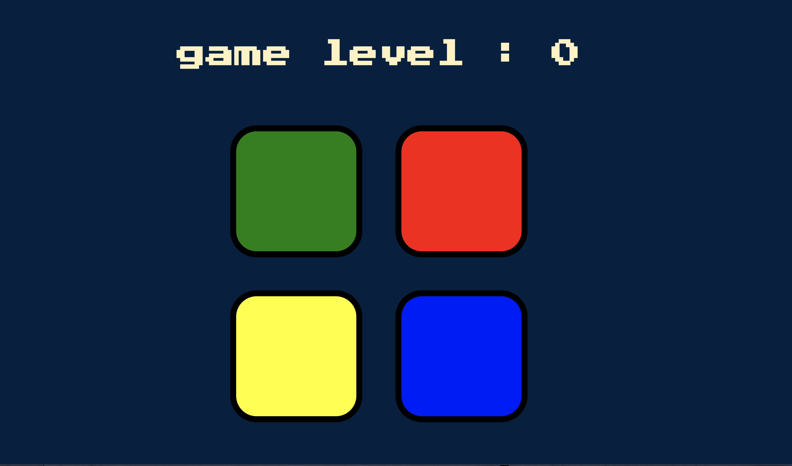

# Simon Game 

#### 1. 这是一个使用html + css + js（jquery） 实现的小游戏

> 西蒙是拉尔夫·鲍尔和霍华德·莫里森发明的一种记忆技能电子游戏，他在玩具设计公司马文·格拉斯和协会工作，和伦尼·科普的软件编程。该设备创建一系列音调和灯光，并要求用户重复该序列。如果用户成功了，这个系列就变得越来越长，越来越复杂。一旦用户失败或时间限制用完，游戏就结束了。最初的版本是由米尔顿布拉德利制造和分发，后来由孩之宝接管米尔顿布拉德利。大部分汇编语言代码是由查尔斯·卡普斯（需要引文）编写的，他在坦普尔大学教授计算机科学，还写了第一本关于计算机编程理论的书。西蒙于1978年在纽约市54工作室成立，并立即获得成功，成为20世纪70年代和80年代流行文化的象征。

### 2. 游戏规则
1. 按任意键开始游戏
2. 四个方块中随机亮起一块
3. 玩家点击亮起过的方块进入下一level
4. 每一次level增加，都要求将之前亮起过的方块按顺序点击
5. 完成后进入下一关;若点击错误，或顺序不对，则挑战失败，屏幕变红，提示音响起，按任意键重新开始。

### 3. 游戏的意义
    锻炼大脑，瞬时记忆力。一般人玩到8或9level时就看来是出错了，你能坚持多少关呢？